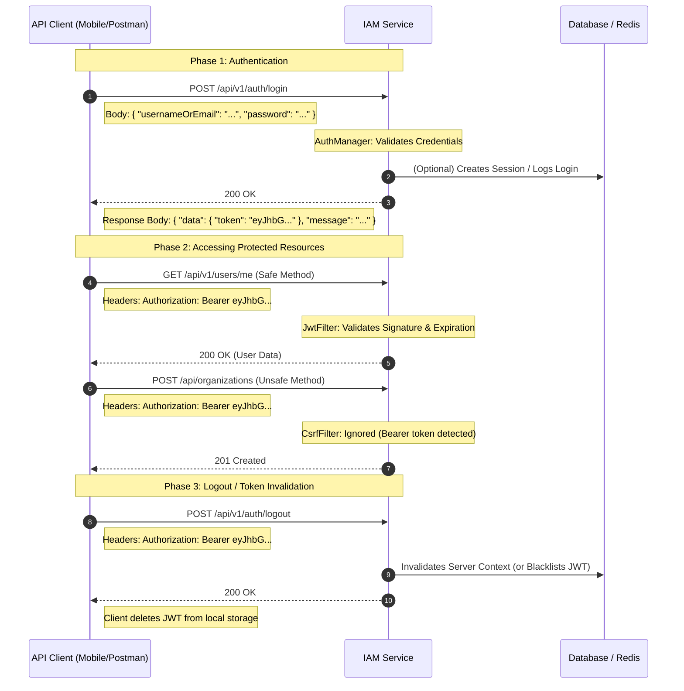
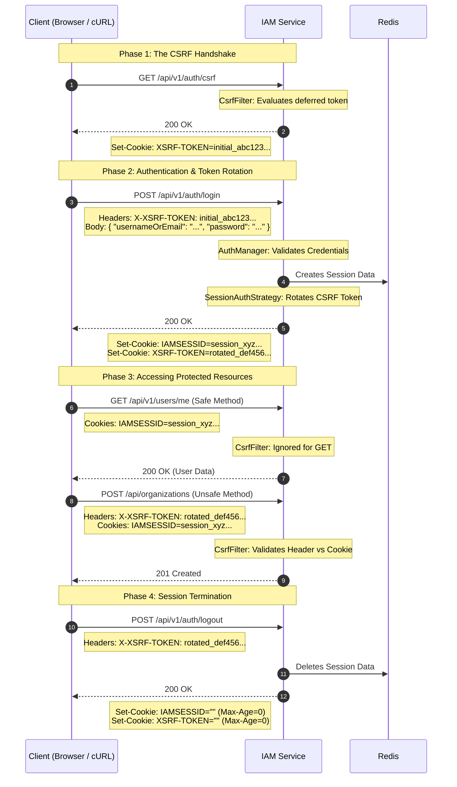
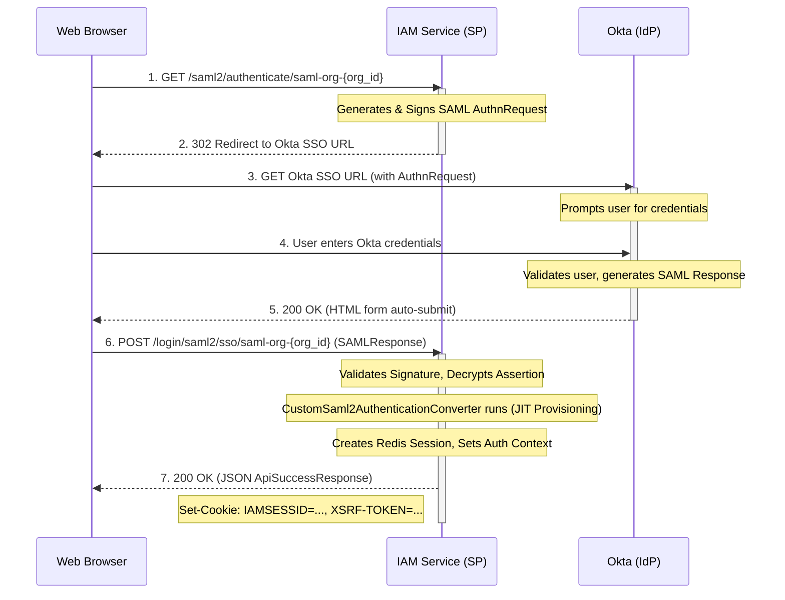
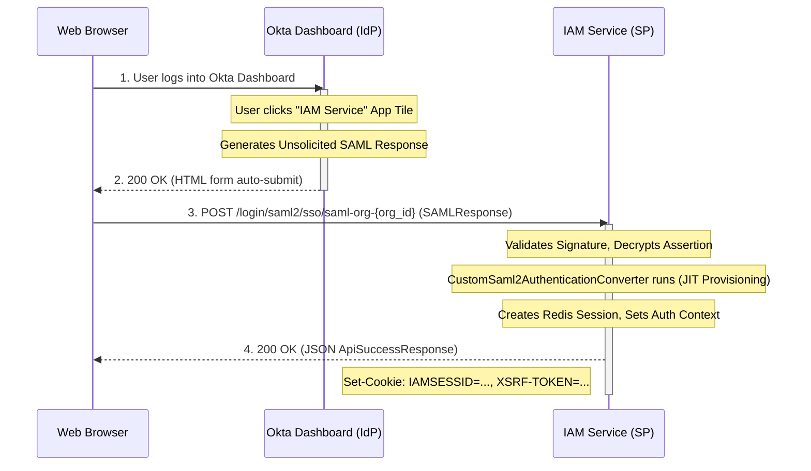
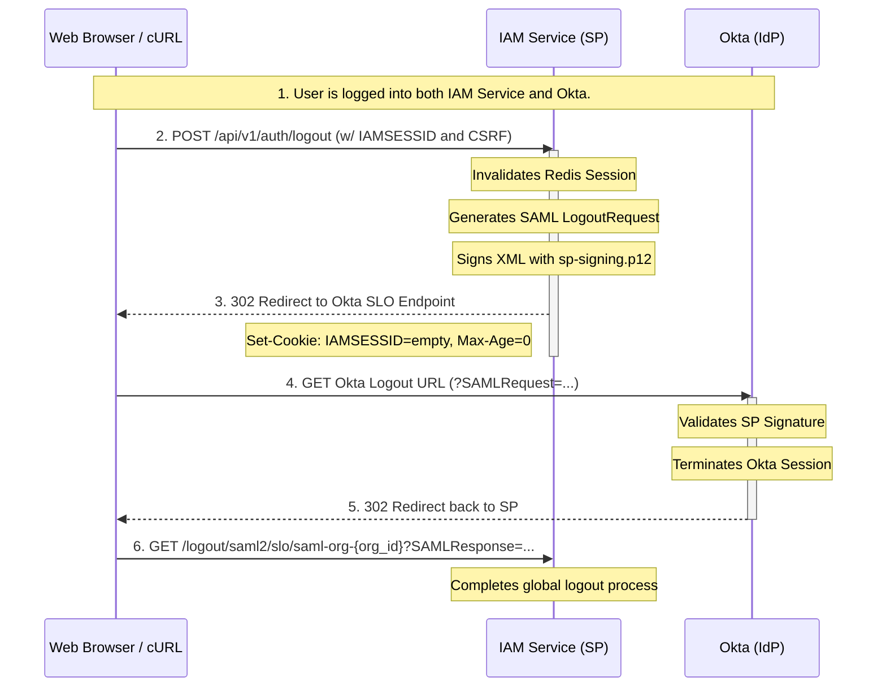
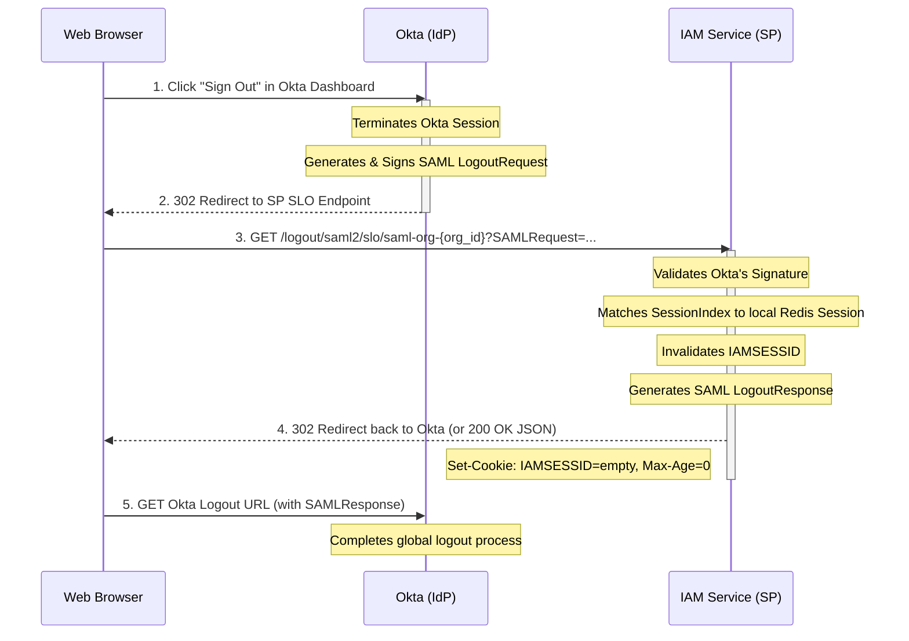

---

# Multi-Tenant IAM Service

## 📖 Overview

This project implements a Multi-Tenant Identity and Access Management (IAM) service. Designed with a microservices-ready architecture, it provides robust core functionalities for managing tenants (organizations), user lifecycles, role-based access control (RBAC), and complex authentication flows.

### 🏗️ 1. Core Architecture & Multi-Tenancy

* **Logical Isolation:** The system utilizes a logical multi-tenancy model where data is isolated at the database level via `Organization` entities. Every user and SSO configuration is strictly bound to a specific tenant.
* **Hierarchical RBAC:** Access control is enforced via Spring Security method-level security (`@PreAuthorize`).
* `SUPER`: Global administrator capable of cross-tenant operations and Organization creation.
* `ADMIN`: Tenant-level administrator restricted to managing users and SSO configurations within their own Organization.
* `USER`: Standard authenticated entity with self-service capabilities.


### 🔐 2. Dual Authentication Strategy

The service exposes a highly flexible, hybrid authentication architecture to support both stateless API clients and stateful web applications simultaneously.

* **Flow A: Stateless API & Mobile (Pure JWT):** Uses JSON Web Tokens (JWT) passed via the `Authorization: Bearer` header. The system utilizes a custom `RequestMatcher` to automatically and safely bypass CSRF requirements for pure API clients.
* **Flow B: Stateful Web & SPAs (Session + CSRF):** Employs Redis-backed HTTP Sessions (`IAMSESSID`) combined with a strict Synchronizer Token Pattern (`XSRF-TOKEN`). Includes advanced security measures such as:
* **Deferred CSRF Handshake:** A dedicated endpoint for frontend clients to securely fetch initial tokens.
* **Session Fixation Protection:** Automatic rotation of the CSRF token upon successful authentication.


* **Federated Identity (SSO):** * Integrates with external Identity Providers via **SAML 2.0** and **OAuth 2.0 / OIDC**.
* **Dynamic Tenant Configuration:** IdP metadata and credentials are stored in the database per organization, allowing the system to handle routing and authentication dynamically without requiring server restarts.
* **Just-In-Time (JIT) Provisioning:** Automatically provisions internal user accounts via custom authentication converters when a user successfully authenticates via a third-party IdP.


### 🛡️ 3. Account Security & Lifecycle Management

The IAM service enforces strict account security policies, managed actively by background schedulers (`UserAccountScheduler`):

* **Brute Force Protection:** Tracks failed authentication attempts and temporarily locks accounts after a configurable threshold.
* **Password Expiration Policies:** Enforces maximum password age, dispatching pre-expiry warning notifications to users and administrators, and forcing password resets upon expiration.
* **Dormancy Management:** Automatically identifies and disables accounts that have been inactive for a prolonged period.
* **Self-Service Flows:** Secure, token-based flows for Email Verification (with resend capabilities) and Password Resets.

### 📡 4. Event-Driven Auditing (Transactional Outbox Pattern)

To ensure zero data loss and decouple auditing from core business logic, the system implements the **Transactional Outbox Pattern**:

1. **Synchronous Commit:** Critical security actions (logins, config changes, lockouts) generate an `AuditEvent` that is saved to the MySQL database in the exact same transaction as the business data.
2. **Asynchronous Publishing:** A scheduled poller (`AuditEventScheduler`) reads unpublished events and reliably streams them to an **Apache Kafka** topic.
3. **Dedicated Consumer:** A secondary microservice (`iam-consumer`) consumes these events for downstream processing (e.g., SIEM integration, analytics, or cold storage), featuring manual acknowledgment and Dead Letter Topic (DLT) routing for ultimate reliability.

### 💻 5. Technology Stack

Here is the expanded and highly detailed version of your **Technology Stack** and **Prerequisites** sections. I have added the specific security modules, encryption standards, and architectural patterns we discussed, along with a more comprehensive list of system requirements to ensure anyone setting this up has exactly what they need.

---

## 💻 Technology Stack

This project leverages a modern, robust Java ecosystem designed for enterprise-grade security, high availability, and asynchronous event-driven processing.

**Core Framework & Language**

* **Java 21:** Utilizing the latest LTS release, specifically leveraging preview features for modern syntax and performance.
* **Spring Boot 3.x:** Core application framework for the REST API and dependency injection.

**Security & Identity**

* **Spring Security 6.x:** Highly customized for stateful (Session) and stateless (JWT) hybrid flows.
* **Federated Identity:** Spring Security SAML2 & OAuth2 Client for dynamic, database-driven IdP configurations.
* **Tokens & Sessions:** JJWT (JSON Web Tokens) and Spring Session Data Redis.
* **Cryptography:** BCrypt (Password Hashing) and AES-GCM (Symmetric encryption for database-stored IdP credentials).

**Data Persistence & Caching**

* **Database:** MySQL 8.x (Relational data storage).
* **Migrations:** Flyway (Automated, version-controlled database schema management).
* **ORM:** Spring Data JPA / Hibernate.
* **Cache/Session Store:** Redis (For low-latency session validation and state management).

**Event-Driven Architecture**

* **Messaging:** Apache Kafka.
* **Pattern:** Transactional Outbox Pattern (Guarantees zero-data-loss audit event publishing).

**DevOps, Build & Documentation**

* **Build Tool:** Apache Maven 3.8+.
* **Containerization:** Docker & Docker Compose (For infrastructure provisioning).
* **API Documentation:** Springdoc OpenAPI 3 (Swagger UI).
* **Utilities:** Lombok (Boilerplate reduction), Jakarta Validation (Input sanitization).

**Note on Architecture:** This project utilizes a hybrid development environment. The backing infrastructure (MySQL, Redis, Kafka) and the asynchronous `iam-consumer` service run inside **Docker**, while the main `iam-service` REST API is intended to be run locally via your **IDE** or terminal to facilitate rapid development and debugging.

---

## 🚀 Getting Started

### 📋 Prerequisites

Before cloning and running the project, ensure your local development environment meets the following requirements:

**1. Development Tools**

* **Java Development Kit (JDK) 21:** (e.g., Azul Zulu, Amazon Corretto, or Eclipse Temurin). *Note: The application requires `--enable-preview` compiler flags.*
* **Apache Maven 3.8+:** Installed and available in your system `PATH`.
* **IDE:** IntelliJ IDEA (Recommended), VS Code, or Eclipse, properly configured to support Java 21 preview features.

**2. Infrastructure Tools**

* **Docker Desktop / Docker Engine:** Installed and running.
* **Docker Compose:** For orchestrating the multi-container infrastructure.

**3. API Testing**

* **Postman** (Highly Recommended): Used to import the provided JSON collections which automatically handle the complex Session + CSRF token extraction scripts. Alternatively, `cURL` or Insomnia.

**4. System Requirements (Port Availability)**
Ensure the following ports are free on your host machine before starting the Docker containers or the Spring application:

* `8080`: Main IAM Spring Boot API
* `3306`: MySQL Database
* `6379`: Redis Cache
* `9092`: Apache Kafka Broker
* `2181`: Zookeeper (Required by Kafka)


### 🔐 Step 1: Security Configuration and Generating Secret Keys 

This project employs a hybrid security model to support both stateless API clients (via pure JWT) and stateful browser applications (via Redis-backed sessions and CSRF protection).


Before starting the application, you must configure secure keys in your .env file. The application requires 256-bit (32-byte) Base64-encoded strings for cryptographic operations.
You can easily generate these securely using openssl in your terminal:

```bash
# Generate a 256-bit Base64 encoded key
openssl rand -base64 32
```

Run this command twice and paste the outputs into your .env file:

1. SECURITY_JWT_SECRET: Used to cryptographically sign the JSON Web Tokens.
2. APP_ENCRYPTION_KEY: A master AES-GCM key used to symmetrically encrypt sensitive data in the database (like OAuth2 Client Secrets and SAML Keystore passwords).

### 🛠️ Step 2: Environment Configuration

The application relies on environment variables for secure credentials and configuration.

1. Locate the `.env` file in the root `iam` directory. *(Note: Ensure this file remains in your `.gitignore` to prevent leaking secrets).*
2. Open the `.env` file and verify the credentials.
3. Ensure `SECURITY_JWT_SECRET` and `APP_ENCRYPTION_KEY` are populated with secure, Base64-encoded strings (default templates are already provided in the file).

### 🐳 Step 3: Start Infrastructure & Consumer

The `docker-compose.yml` uses a multi-stage build to compile and run the `iam-consumer` safely alongside the infrastructure services.

1. Open a terminal and navigate to the main `iam` project directory.
2. Build the consumer image and start all services in detached mode:
```bash
docker-compose up -d --build

```


3. **Verify Health:** Wait about 30–60 seconds for Kafka and MySQL to fully initialize. Run the following command to ensure all containers (`iam_mysql`, `iam_redis`, `iam_kafka`, `iam_zookeeper`, `iam_mailhog`, `iam_kafdrop`, and `iam_kafka_consumer`) show a status of `Up` and `Healthy`:
```bash
docker-compose ps

```


### ☕ Step 4: Start the Main IAM API (Local IDE)

Because the main service uses modern Java 21 preview features (like Virtual Threads) and requires secure environment variables, you must configure your IDE Run Profile.

1. Open the `iam` folder as a Maven project in IntelliJ IDEA.
2. Navigate to **File > Project Structure** and verify the Project SDK is set to **Java 21** and the Language Level is set to **21 (Preview)**.
3. Go to **Run > Edit Configurations...** and create a new **Spring Boot** or **Application** configuration for `org.example.iam.IamApplication`.


4**Add Environment Variables:** Copy the required credentials from your `.env` file and paste them into the "Environment variables" field. For example:
```properties
MYSQL_PASSWORD=your_mysql_password;SECURITY_JWT_SECRET=your_base64_jwt_secret_key;APP_ENCRYPTION_KEY=your_base64_encryption_key
```


5.Click **Run**. Flyway will automatically execute migrations to set up the schema and seed the initial Super User.

---

## 📊 Accessing UIs & Monitoring

Once everything is running, you can monitor the entire multi-tenant data flow using the following local interfaces.

### 1. Main Application & API Docs

* **[Swagger UI (OpenAPI)](https://www.google.com/search?q=http://localhost:8080/swagger-ui.html)**
* Use this to test REST endpoints.
* *Authentication Note:* For stateful `POST`/`PUT` endpoints, hit `/api/v1/auth/csrf` first to get an `X-XSRF-TOKEN`, and pass it as a header alongside your JWT cookie.


### 2. Kafka & Event Streaming

* **[Kafdrop (Kafka Web UI)](https://www.google.com/search?q=http://localhost:9000)**
* View the active broker, monitor consumer groups, and inspect the JSON payloads of audit events on the `iam-audit-events` topic.


* **Consumer Logs:** Watch real-time logs of the `iam-consumer` processing outbox events:
```bash
docker logs -f iam_kafka_consumer

```


### 3. Email Notifications

* **[MailHog UI](https://www.google.com/search?q=http://localhost:8025)**
* The application routes all outbound emails (account verification, password resets) to this local SMTP sinkhole. View rendered emails here without sending actual spam.


### 4. Database Management (MySQL)

Connect using your IDE's Database tool (e.g., DataGrip) or MySQL Workbench using the following credentials:

* **Host:** `localhost`
* **Port:** `3306`
* **User:** `iam_user`
* **Password:** `iam_password_change_me` *(or the value in your `.env`)*
* **Database:** `iam_db`

### 5. Redis Session Cache

This project uses Redis to handle distributed user sessions.

* **[Redis Commander (Web UI)](https://www.google.com/search?q=http://localhost:8081)**
* A web-based management tool running directly in Docker. Open this URL to easily view, edit, and monitor the active Spring Session keys and JWT metadata stored in Redis without needing a desktop client.


* **Redis CLI:** If you prefer the terminal, you can interact with the cache directly from the container:
```bash
docker exec -it iam_redis redis-cli

```
---

## Testing Authentication Flows (cURL)

The system supports two distinct ways to authenticate and consume the APIs.

Here is the complete, detailed markdown section for **Flow A: Pure JWT Authentication**.

This flow is much simpler than the cookie flow because your `SecurityConfig` includes that brilliant custom `RequestMatcher` which automatically bypasses CSRF checks anytime it sees a `Bearer` token.

---

## 🔑 Authentication Flow A: Pure JWT (API Clients & Mobile)

This flow is designed for server-to-server communication, mobile applications, and automated API testing tools. It uses a **JSON Web Token (JWT)** passed via the `Authorization` header.

Because the client is not a browser, it ignores the `Set-Cookie` headers. Additionally, our security configuration automatically **bypasses CSRF protection** when a valid `Bearer` token is present, as API clients are not vulnerable to Cross-Site Request Forgery in the same way browsers are.

### 📊 Architecture & Flow Diagram



---

### 🧪 Testing the Flow via cURL

For this flow, we do not need a cookie jar (`-c` or `-b`). We will simply extract the JWT from the login response and manually attach it to the `Authorization` header of subsequent requests.

#### Step 1: Login & Extract JWT

Send the credentials to the login endpoint. The response will contain a JSON payload with your JWT.

```bash
# Execute login and capture the response
curl -s -X POST http://localhost:8080/api/v1/auth/login \
  -H "Content-Type: application/json" \
  -d '{
    "usernameOrEmail": "superuser1",
    "password": "password"
  }' | jq

# Copy the "token" value from the JSON response and export it to your terminal:
export JWT="eyJhbGciOiJIUzI1NiJ9..." 

```

#### Step 2: Access a Safe Endpoint (`GET`)

Pass the JWT in the header. Notice that we do not need to worry about cookies or CSRF handshakes.

```bash
curl -i -X GET http://localhost:8080/api/v1/users/me \
  -H "Authorization: Bearer ${JWT}"

```

#### Step 3: Access an Unsafe Endpoint (`POST`)

Because our `SecurityConfig` contains a custom matcher that ignores CSRF for requests containing a `Bearer` token, this `POST` request will succeed without an `X-XSRF-TOKEN` header.

```bash
curl -i -X POST http://localhost:8080/api/organizations \
  -H "Content-Type: application/json" \
  -H "Authorization: Bearer ${JWT}" \
  -d '{
    "orgName": "API Test Org",
    "orgDomain": "api-client.com",
    "loginType": "SAML"
  }'

```

#### Step 4: Logout

Calling the logout endpoint clears the server's security context. For pure JWT flows, the most important step is for the client (e.g., your mobile app) to delete the token from its local storage.

```bash
curl -i -X POST http://localhost:8080/api/v1/auth/logout \
  -H "Authorization: Bearer ${JWT}"

```

> **Verification:** Attempting to run Step 2 or 3 again with the same token will result in a `401 Unauthorized` (if your backend implements JWT blacklisting upon logout) or will simply be rejected once the JWT hits its expiration time.

---


### 🔐 Authentication Flow B: Session & XSRF Cookie (SPAs & Web Clients)

This IAM service employs a highly secure, stateful authentication architecture designed specifically for Single Page Applications (React, Angular, Vue). It uses **Redis-backed HTTP Sessions** (`IAMSESSID`) for identity and **Synchronizer Token Pattern** (`XSRF-TOKEN`) for Cross-Site Request Forgery (CSRF) protection.

This diagram illustrates the lifecycle of a web session, specifically highlighting the **Deferred CSRF Handshake** and **Token Rotation** upon login to prevent session fixation attacks.



---

### 🧪 Testing the Flow via cURL

To test this flow in the terminal, we use cURL's built-in cookie jar (`-c` to save cookies, `-b` to read them) and standard UNIX tools (`grep`/`awk`) to extract the CSRF token for our headers.

#### Step 1: Initialize the CSRF Token (The Handshake)

Fetch the initial CSRF token and save it to `cookies.txt`.

```bash
curl -s -c cookies.txt -X GET http://localhost:8080/api/v1/auth/csrf

```

> **Verification:** Run `cat cookies.txt`. You should see a domain entry for `localhost` with the `XSRF-TOKEN`.

#### Step 2: Login and Rotate Tokens

Extract the initial token from the cookie file and pass it in the `X-XSRF-TOKEN` header. When login succeeds, Spring will write the `IAMSESSID` to `cookies.txt` and **rotate** the `XSRF-TOKEN` to a new value.

```bash
# Extract the initial token
export CSRF_TOKEN=$(grep XSRF-TOKEN cookies.txt | awk '{print $7}')

# Perform Login
curl -i -b cookies.txt -c cookies.txt -X POST http://localhost:8080/api/v1/auth/login \
  -H "Content-Type: application/json" \
  -H "X-XSRF-TOKEN: ${CSRF_TOKEN}" \
  -d '{
    "usernameOrEmail": "superuser1",
    "password": "password"
  }'

```

#### Step 3: Access a Safe Endpoint (`GET`)

For read-only operations (`GET`), Spring Security ignores CSRF requirements. You only need to send the session cookie.

```bash
curl -s -b cookies.txt -X GET http://localhost:8080/api/v1/users/me | jq

```

#### Step 4: Access an Unsafe Endpoint (`POST`)

For state-modifying operations, you **must** provide the newly rotated CSRF token in the header.

```bash
# Extract the newly rotated token
export NEW_CSRF_TOKEN=$(grep XSRF-TOKEN cookies.txt | awk '{print $7}')

# Create an Organization
curl -i -b cookies.txt -X POST http://localhost:8080/api/organizations \
  -H "Content-Type: application/json" \
  -H "X-XSRF-TOKEN: ${NEW_CSRF_TOKEN}" \
  -d '{
    "orgName": "Terminal Test Org",
    "orgDomain": "terminal.com",
    "loginType": "JWT"
  }'

```

> *Note: If you omit the `-H "X-XSRF-TOKEN: ${NEW_CSRF_TOKEN}"` line, you will correctly receive a `403 Forbidden` response.*

#### Step 5: Logout

Logout destroys the Redis session and clears the cookies. Because it is a `POST` request, it requires the CSRF header.

```bash
curl -i -b cookies.txt -c cookies.txt -X POST http://localhost:8080/api/v1/auth/logout \
  -H "X-XSRF-TOKEN: ${NEW_CSRF_TOKEN}"

```

> **Verification:** Run `cat cookies.txt`. The `IAMSESSID` and `XSRF-TOKEN` values should now be empty or removed, and subsequent requests to `/api/v1/users/me` will return `401 Unauthorized`.

---
---

## 🛡️ SAML 2.0 Identity Provider (IdP) Integration Guide

This project supports multi-tenant SAML 2.0 SSO with Just-In-Time (JIT) provisioning. Each organization can configure its own external Identity Provider (like Okta, Auth0, or Azure AD).

This guide uses **Okta** as the example IdP.

### Prerequisites
* The `iam-service` is running locally.
* You have a master `APP_ENCRYPTION_KEY` set in your environment (used to encrypt keystore passwords in the DB).
* Access to an Okta Developer account.

---

### Step 1: Generate SP Cryptographic Keys (PKCS#12)
Your application (the Service Provider) requires private keys and public certificates to sign outgoing AuthnRequests and decrypt incoming Assertions. We will generate two separate PKCS#12 keystores using `openssl`.

**1. Create a secure directory:**
```bash
mkdir ~/iam-saml-certs && cd ~/iam-saml-certs
```

**2. Generate the Signing Key Pair:**
```bash
# Set secure passwords
SIGNING_KS_PASS="SecureKeyPass123!"
SIGNING_KEY_PASS="SecureKeyPass123!"

# Generate Private Key & CSR
openssl genrsa -aes256 -passout pass:${SIGNING_KEY_PASS} -out sp-signing.key 2048
openssl req -new -key sp-signing.key -out sp-signing.csr -subj "/CN=IAM SP Signing" -passin pass:${SIGNING_KEY_PASS}

# Generate Self-Signed Public Certificate
openssl x509 -req -days 3650 -in sp-signing.csr -signkey sp-signing.key -out sp-signing.crt -passin pass:${SIGNING_KEY_PASS}

# Package into PKCS#12 Keystore
keytool -genkeypair -alias sp-signing-alias \
  -keyalg RSA -keysize 2048 -validity 3650 \
  -storetype PKCS12 \
  -keystore sp-signing.p12 \
  -storepass SecureKeyPass123! \
  -keypass SecureKeyPass123! \
  -dname "CN=IAM SP Signing"

# Extract Public Cert (PEM) to upload to Okta
keytool -exportcert -alias sp-signing-alias \
  -keystore sp-signing.p12 -storepass SecureKeyPass123! -rfc \
  -file sp-signing-cert.pem

```

**3. Generate the Encryption Key Pair:**
```bash
# Set secure passwords
ENCRYPT_KS_PASS="SecureEncKeyPass123!"
ENCRYPT_KEY_PASS="SecureEncKeyPass123!"

# Generate Private Key & CSR
openssl genrsa -aes256 -passout pass:${ENCRYPT_KEY_PASS} -out sp-encryption.key 2048
openssl req -new -key sp-encryption.key -out sp-encryption.csr -subj "/CN=IAM SP Encryption" -passin pass:${ENCRYPT_KEY_PASS}

# Generate Self-Signed Public Certificate
openssl x509 -req -days 3650 -in sp-encryption.csr -signkey sp-encryption.key -out sp-encryption.crt -passin pass:${ENCRYPT_KEY_PASS}

# Package into PKCS#12 Keystore
keytool -genkeypair -alias sp-encryption-alias \
  -keyalg RSA -keysize 2048 -validity 3650 \
  -storetype PKCS12 \
  -keystore sp-encryption.p12 \
  -storepass SecureEncKeyPass123! \
  -keypass SecureEncKeyPass123! \
  -dname "CN=IAM SP Encryption"

# Extract Public Cert (PEM) to upload to Okta
keytool -exportcert -alias sp-encryption-alias \
  -keystore sp-encryption.p12 -storepass SecureEncKeyPass123! -rfc \
  -file sp-encryption-cert.pem
```
*Note: Make a note of the absolute paths to `sp-signing.p12` and `sp-encryption.p12` on your machine.*

---

### Step 2: Prepare the Tenant in IAM Service
Create an organization and a placeholder user for testing.

```bash
# 1. Login as Superuser
export SUPER_TOKEN=$(curl -s -X POST http://localhost:8080/api/v1/auth/login -H "Content-Type: application/json" -d '{"usernameOrEmail":"superuser1","password":"password"}' | jq -r .data.accessToken)

# 2. Create Organization (Note: loginType is set to SAML)
export ORG_ID=$(curl -s -X POST http://localhost:8080/api/v1/organizations -H "Authorization: Bearer $SUPER_TOKEN" -H "Content-Type: application/json" -d '{"orgName": "Okta Org", "orgDomain": "okta-test.com", "loginType": "SAML"}' | jq -r .data.id)

# 3. Create Placeholder User
curl -X POST http://localhost:8080/api/v1/users \
  -H "Authorization: Bearer $SUPER_TOKEN" \
  -H "Content-Type: application/json" \
  -d '{
    "username": "saml.tester",
    "primaryEmail": "saml.tester@okta-test.com",
    "organizationId": "'$ORG_ID'",
    "roleType": "USER"
  }'
```

---

### Step 3: Configure SAML in IAM Service (SP)
We must configure the service provider details using the API. The `ConfigService` will securely encrypt your keystore passwords before saving them.

Create a file named `saml_payload.json` and replace the `YOUR_ABSOLUTE_PATH` placeholders with the path to the keystores you generated in Step 1.
```json
{
  "identityProviderMetadataUrl": null,
  "serviceProviderEntityId": "urn:example:iam:sp:OKTA_ORG",
  "assertionConsumerServiceUrl": "http://localhost:8080/login/saml2/sso/saml-org-REPLACE_WITH_ORG_ID",
  "singleLogoutServiceUrl": "http://localhost:8080/logout/saml2/slo/saml-org-REPLACE_WITH_ORG_ID",
  "nameIdFormat": "urn:oasis:names:tc:SAML:1.1:nameid-format:emailAddress",
  "signRequests": true,
  "wantAssertionsSigned": true,
  "identityProviderEntityId": null,
  "singleSignOnServiceUrl": null,
  "singleSignOnServiceBinding": "POST",
  "spSigningKeystorePathInput": "file:/YOUR_ABSOLUTE_PATH/sp-signing.p12",
  "spSigningKeystorePasswordInput": "SecureKsPass123!",
  "spSigningKeyAliasInput": "sp-signing-alias",
  "spSigningKeyPasswordInput": "SecureKeyPass123!",
  "spEncryptionKeystorePathInput": "file:/YOUR_ABSOLUTE_PATH/sp-encryption.p12",
  "spEncryptionKeystorePasswordInput": "SecureEncKsPass456!",
  "spEncryptionKeyAliasInput": "sp-encryption-alias",
  "spEncryptionKeyPasswordInput": "SecureEncKeyPass456!",
  "enabled": true
}
```

Apply the configuration:
```bash
# Replace REPLACE_WITH_ORG_ID inside the JSON file with the actual UUID first!
curl -X PUT http://localhost:8080/api/v1/organizations/$ORG_ID/config/saml \
  -H "Authorization: Bearer $SUPER_TOKEN" \
  -H "Content-Type: application/json" \
  -d @saml_payload.json
```

---

### Step 4: Configure Okta (IdP)
1. Go to your Okta Developer Dashboard -> **Applications** -> **Create App Integration** -> **SAML 2.0**.
2. **General Settings:**
   * **Single sign-on URL:** `http://localhost:8080/login/saml2/sso/saml-org-<ORG_ID>`
   * **Audience URI (SP Entity ID):** `urn:example:iam:sp:OKTA_ORG`
   * **Name ID format:** `EmailAddress`
   * **Application username:** `Email`
3. **Advanced Settings:**
   * **Assertion Encryption:** Choose `Encrypted`. Upload `sp-encryption-cert.pem`.
   * **Enable Single Logout:** Check the box.
   * **Single Logout URL:** `http://localhost:8080/logout/saml2/slo/saml-org-<ORG_ID>`
   * **Signature Certificate:** Upload `sp-signing-cert.pem` (for verifying SLO).
4. Finish the setup and assign the user `saml.tester@okta-test.com` to the app.
5. On the "Sign On" tab, copy the **Metadata URL**.

---

### Step 5: Finalize Configuration & Restart
Update the configuration in the IAM Service with the Metadata URL you just copied from Okta.

```bash
# Update your saml_payload.json file with the "identityProviderMetadataUrl": "[https://dev-XXXX.okta.com/app/exk.../sso/saml/metadata](https://dev-XXXX.okta.com/app/exk.../sso/saml/metadata)"

curl -X PUT http://localhost:8080/api/v1/organizations/$ORG_ID/config/saml \
  -H "Authorization: Bearer $SUPER_TOKEN" \
  -H "Content-Type: application/json" \
  -d @saml_payload.json
```
**🚨 CRITICAL:** Restart the `iam-service` application in your IDE. The `DatabaseRelyingPartyRegistrationRepository` caches configurations at startup (`@PostConstruct`), so a restart is required to load the new Okta metadata into Spring Security.

---

### Step 6: Testing Authentication Flows

Because SAML relies on browser HTTP redirects and cross-domain HTML Form POSTs, you must test the actual login flows in a real Web Browser. Standard `cURL` commands cannot easily follow multi-step SAML SSO flows.

#### Flow A: SP-Initiated Login Flow
In the Service Provider (SP) initiated flow, the user starts at your application. Your application generates a SAML `AuthnRequest`, signs it, and redirects the user to Okta. After successful authentication, Okta redirects them back.



**How to test SP-Initiated Login:**
1. Open a new Incognito Browser window.
2. Navigate to your SP's initialization endpoint:
   `http://localhost:8080/saml2/authenticate/saml-org-<ORG_ID>`
3. You will be instantly redirected to the Okta login screen.
4. Enter the credentials for `saml.tester@okta-test.com`.
5. Upon success, you will be redirected back to `localhost:8080`. Your browser will display the JSON `LoginResponse` payload generated by the `CustomSamlAuthenticationSuccessHandler`.

---

#### Flow B: IdP-Initiated Login Flow
In the Identity Provider (IdP) initiated flow, the user logs directly into their Okta dashboard. They click the "App Tile" for your application, and Okta fires an unsolicited SAML Response directly to your application without a prior request.



**How to test IdP-Initiated Login:**
1. Open a new Incognito Browser window.
2. Log in directly to `https://<YOUR_DEV_DOMAIN>.okta.com` using the `saml.tester@okta-test.com` account.
3. On the Okta User Dashboard, click the tile for the application you created (e.g., "IAM Service Test").
4. Okta will immediately POST the assertion to your application. Your browser will display the JSON `LoginResponse` payload generated by the `CustomSamlAuthenticationSuccessHandler`.

---

#### Post-Login API Testing (Session + CSRF)
Once you have successfully logged in via SAML (using either flow), Spring Security creates a Redis-backed session for you. Because you are now testing stateful browser authentication, you must extract the cookies from your browser to perform subsequent API requests.

1. Open Chrome DevTools (`F12`) -> **Application** -> **Cookies** -> `http://localhost:8080`.
2. Copy the value of the `IAMSESSID` cookie.
3. Copy the value of the `XSRF-TOKEN` cookie.
4. Use `cURL` to test a state-changing endpoint:

```bash
# Replace with the actual values copied from your browser
SESSION_COOKIE="PASTE_IAMSESSID_HERE"
CSRF_TOKEN="PASTE_XSRF_TOKEN_HERE"
USER_ID="PASTE_USER_ID_FROM_LOGIN_RESPONSE"

curl -X PUT http://localhost:8080/api/v1/users/${USER_ID} \
  --cookie "IAMSESSID=${SESSION_COOKIE}; XSRF-TOKEN=${CSRF_TOKEN}" \
  -H "X-XSRF-TOKEN: ${CSRF_TOKEN}" \
  -H "Content-Type: application/json" \
  -d '{
    "firstName": "SAML",
    "lastName": "Tester"
  }'
```
## Detailed, step-by-step guide to testing both SLO flows.
---


### 🚀 Flow A: SP-Initiated Single Logout (SLO)

In the Service Provider (SP) initiated logout flow, the user clicks "Log Out" inside your application first. Your Spring Boot backend immediately destroys the local Redis session, then generates a cryptographically signed SAML `LogoutRequest` and redirects the user's browser to Okta so Okta can destroy its session as well.

#### 📊 SP-Initiated SLO Architecture



#### 🧪 How to Test SP-Initiated SLO via Terminal

Because this flow originates from your backend, it is actually the best way to verify that your Spring Boot application is correctly reading your `sp-signing.p12` keystore, generating valid XML, and compressing it for HTTP transport.

**Step 1: Capture an Active Session**
First, you need to log into your application via the browser to generate valid session cookies.

1. Open your browser and complete a successful SAML login.
2. Open Chrome Developer Tools (`F12`) -> **Application** -> **Cookies**.
3. Copy the values of your `IAMSESSID` and `XSRF-TOKEN` cookies.
4. Export them into your terminal session so we can pass them to `cURL`:

```bash
export SESSION_COOKIE="PASTE_YOUR_IAMSESSID_HERE"
export CSRF_TOKEN="PASTE_YOUR_XSRF_TOKEN_HERE"

```

**Step 2: Trigger the Logout via cURL**
Because you are modifying the state of the application (destroying a session), Spring Security requires an HTTP `POST` accompanied by the CSRF token.

Execute this verbose (`-v`) request:

```bash
curl -v -X POST http://localhost:8080/api/v1/auth/logout \
  --cookie "IAMSESSID=${SESSION_COOKIE}; XSRF-TOKEN=${CSRF_TOKEN}" \
  -H "X-XSRF-TOKEN: ${CSRF_TOKEN}"

```

**Step 3: Analyze the Output**
Check the terminal output generated by the `-v` flag. You are looking for two exact HTTP headers from your Spring Boot server that prove the entire operation was a success:

1. **The Session Kill Order:** You should see Spring Boot telling the client to delete the local cookie.
> `< Set-Cookie: IAMSESSID=""; Expires=Thu, 01 Jan 1970 00:00:00 GMT; Path=/; HttpOnly`


2. **The SAML Redirect (LogoutRequest):** You should see an HTTP `302 Found` response containing a `Location` header pointing to Okta, carrying the deflated, Base64-encoded XML payload.
> `< HTTP/1.1 302 Found`
> `< Location: https://dev-xxxx.okta.com/app/xxxx/sso/saml?SAMLRequest=fZJfc...`


**Step 4: The Final Hop (Optional)**
If you copy that `Location` URL starting with `https://dev-xxxx...` and paste it into the same browser where you are currently logged into Okta, Okta will instantly process the request, log you out of the dashboard, and redirect you back to your Spring Boot app's final logout success route!

---

With both login and logout fully documented, your SAML implementation is bulletproof.

Ready to tackle the next section of the documentation? Shall we map out the **OAuth2 / OIDC Integration**, or shift focus to the backend architecture with **Kafka Event Streaming**?

### 🔄 Flow B: IdP-Initiated Single Logout (SLO)

In the Identity Provider (IdP) initiated logout flow, the user terminates their session directly from their Okta dashboard. Okta then sends a cryptographically signed SAML `LogoutRequest` to your application in the background to ensure the local `IAMSESSID` is destroyed.

#### 📊 IdP-Initiated SLO Architecture



#### 🧪 How to Test IdP-Initiated SLO

Because SAML `LogoutRequests` are deflated, Base64-encoded XML documents containing strict timestamps and dynamic `SessionIndex` values, you **cannot** write one by hand. To test this using the command line, we must first intercept a real request generated by Okta.

**Step 1: Establish the Sessions**
1. Open an **Incognito/Private Browser** window.
2. Navigate directly to your Okta Developer domain (e.g., `https://dev-xxxx.okta.com`) and log in as your test user.
3. Click your **IAM Service app tile**. You will be redirected to your Spring Boot app and logged in (establishing the `IAMSESSID`).

**Step 2: Intercept the Logout Request**
1. Go back to the browser tab with your Okta Dashboard.
2. Open Chrome DevTools (`F12`) and go to the **Network** tab.
3. Check the **"Preserve log"** checkbox (crucial, as redirects will wipe the log otherwise).
4. Click your profile name in the top right of Okta and click **Sign Out**.
5. In the Network tab, look for the HTTP `GET` request made to your local backend. It will look like this:
   `http://localhost:8080/logout/saml2/slo/saml-org-<YOUR_ORG_ID>?SAMLRequest=fZJfc...`
6. Right-click that specific network request -> **Copy** -> **Copy as cURL**.

**Step 3: Execute the Logout via Terminal**
*Note: If your browser already followed the redirect, the session is already dead! To test it purely via `cURL`, log back in (Step 1), intercept the URL again, but cancel the browser request before it finishes, then run it in your terminal.*

Paste the copied `cURL` command into your terminal. It will look something like this:

```bash
# This is a representation. Use your intercepted cURL command.
curl -v -X GET "http://localhost:8080/logout/saml2/slo/saml-org-<YOUR_ORG_ID>?SAMLRequest=<ENCODED_XML_PAYLOAD>"
```

**Step 4: Verify the Output**
Look at the verbose output in your terminal. If your Spring Boot app successfully validates Okta's signature and kills the session, you will see two things:
1. **The Session is Dead:** A header explicitly clearing your cookie: `Set-Cookie: IAMSESSID=""; Expires=Thu, 01 Jan 1970...`
2. **The SAML Response:** A `302 Found` redirect pointing back to Okta with the `LogoutResponse` confirming the termination:
   `Location: https://dev-xxxx.okta.com/.../logout?SAMLResponse=...`

If you try to use your `IAMSESSID` in Postman after this executes, you will receive a `401 Unauthorized`!

---

## 🔄 Full Lifecycle API Journey - Login as SuperUser, Organization Creation, User Craetion, User account Life Cycle

This section walks through the complete end-to-end lifecycle mimicking a secure Web Browser or SPA. It uses Redis-backed HTTP sessions (`IAMSESSID`) and strictly enforces CSRF protection (`XSRF-TOKEN`) for state-modifying actions.

> **💡 Security Pro-Tip:** In this project, endpoints under `/api/v1/auth/**` (like login, reset password, etc.) are explicitly ignored by the CSRF filter to allow public access. However, secured endpoints like creating users or organizations *strictly* require the `X-XSRF-TOKEN` header.

> **📨 Email Note:** For steps generating an email (Verification, Forgot Password), open **MailHog** at [http://localhost:8025](http://localhost:8025) to view the rendered email and extract the tokens.

---

### Phase 1: Administrator Setup

#### 1. Initialize Security Context (Get Initial CSRF)
Before we can log in securely, we must request an initial CSRF token to prevent login forgery.
```bash
curl -c admin_cookies.txt -X GET http://localhost:8080/actuator/health
```
* **Explanation:** We hit a public endpoint. The server generates an `XSRF-TOKEN` cookie and saves it into `admin_cookies.txt`. Open this file and copy the token value for the next step.

#### 2. Login as Super Admin
Authenticate to establish a session in Redis.
```bash
curl -b admin_cookies.txt -c admin_cookies.txt -X POST http://localhost:8080/api/v1/auth/login \
  -H "Content-Type: application/json" \
  -H "X-XSRF-TOKEN: <PASTE_INITIAL_XSRF_TOKEN_HERE>" \
  -d '{
    "username": "superuser1",
    "password": "password"
  }'
```
* **Explanation:** We pass our existing cookies (`-b`) and save any updates (`-c`). The server validates the credentials, creates a session in Redis, sets the `IAMSESSID` cookie, and **rotates** the `XSRF-TOKEN` cookie for security. *(Note: Open `admin_cookies.txt` again and copy the newly rotated `XSRF-TOKEN` for the next steps).*

#### 3. Create an Organization (Tenant)
Perform a protected, state-changing action using the admin session.
```bash
curl -b admin_cookies.txt -X POST http://localhost:8080/api/v1/organizations \
  -H "Content-Type: application/json" \
  -H "X-XSRF-TOKEN: <PASTE_NEW_XSRF_TOKEN_HERE>" \
  -d '{
    "orgName": "Acme Corp",
    "orgDomain": "acme.com",
    "loginType": "JWT"
  }'
```
* **Explanation:** We do not need a JWT header. The server authenticates us via the `IAMSESSID` in `admin_cookies.txt` and authorizes the `POST` request because the `X-XSRF-TOKEN` header matches the expected token for this session. *(Save the new Organization ID from the response).*

#### 4. Create a User in the Organization
Provision a new user within the newly created tenant.
```bash
curl -b admin_cookies.txt -X POST http://localhost:8080/api/v1/users \
  -H "Content-Type: application/json" \
  -H "X-XSRF-TOKEN: <PASTE_NEW_XSRF_TOKEN_HERE>" \
  -d '{
    "username": "jdoe",
    "email": "jdoe@acme.com",
    "firstName": "John",
    "lastName": "Doe",
    "role": "USER",
    "organizationId": "<ORGANIZATION_ID>"
  }'
```
* **Explanation:** The admin session is reused. The system creates the user in a `DISABLED` state and dispatches an asynchronous Kafka event, which triggers an account verification email to MailHog. *(Save the new User ID).*

---


### Phase 2: User Account Lifecycle

#### 5. Verify User Email (Public Endpoint)
The user clicks the verification link in their email to activate their account.
```bash
curl -X GET "http://localhost:8080/api/v1/auth/verify-email?token=<VERIFICATION_TOKEN_FROM_MAILHOG>"
```
* **Explanation:** This simulates clicking a link in an email. It is a public `GET` request, so neither session cookies nor CSRF headers are required. The account status is updated to `ENABLED`.

#### 6. Resend Verification Email (Optional)
If the token expired, the user can request a fresh verification email.
```bash
curl -X POST http://localhost:8080/api/v1/auth/resend-verification \
  -H "Content-Type: application/json" \
  -d '{
    "email": "jdoe@acme.com"
  }'
```
* **Explanation:** While this is a `POST` request, it resides under `/api/v1/auth/`, which is exempt from CSRF checks to allow users who aren't logged in to recover their accounts.

#### 7. Login as the New User
To perform user-specific actions, we authenticate as John Doe. We use a *new* cookie file to avoid mixing up sessions with the admin.
```bash
# First, get a fresh CSRF token for the new browser session
curl -c user_cookies.txt -X GET http://localhost:8080/actuator/health

# Now login (Replace with actual temporary password if one was generated, or standard password)
curl -b user_cookies.txt -c user_cookies.txt -X POST http://localhost:8080/api/v1/auth/login \
  -H "Content-Type: application/json" \
  -H "X-XSRF-TOKEN: <PASTE_USER_INITIAL_XSRF_TOKEN>" \
  -d '{
    "username": "jdoe",
    "password": "temporary_or_default_password"
  }'
```
* **Explanation:** This establishes an isolated session in Redis for `jdoe` and saves their specific `IAMSESSID` and `XSRF-TOKEN` into `user_cookies.txt`.

#### 8. Change Password (Protected Endpoint)
The user updates their password. Because this modifies secure data, full CSRF protection is enforced.
```bash
curl -b user_cookies.txt -X PUT http://localhost:8080/api/v1/users/<USER_ID>/password \
  -H "Content-Type: application/json" \
  -H "X-XSRF-TOKEN: <PASTE_USER_ROTATED_XSRF_TOKEN>" \
  -d '{
    "oldPassword": "temporary_or_default_password",
    "newPassword": "NewSecurePassword123!",
    "confirmPassword": "NewSecurePassword123!"
  }'
```
* **Explanation:** The `PUT` request is validated using `user_cookies.txt` (proving identity) and the `X-XSRF-TOKEN` header (proving intent from a trusted client).

#### 9. Forgot Password Request (Public Endpoint)
If the user forgets their password in the future, they request a reset link.
```bash
curl -X POST http://localhost:8080/api/v1/auth/forgot-password \
  -H "Content-Type: application/json" \
  -d '{
    "email": "jdoe@acme.com"
  }'
```
* **Explanation:** A public endpoint that dispatches a secure password reset token via email. No session required.

#### 10. Reset Password (Public Endpoint)
The user submits their new password using the token retrieved from MailHog.
```bash
curl -X POST http://localhost:8080/api/v1/auth/reset-password \
  -H "Content-Type: application/json" \
  -d '{
    "token": "<RESET_TOKEN_FROM_MAILHOG>",
    "newPassword": "BrandNewPassword456!",
    "confirmPassword": "BrandNewPassword456!"
  }'
```
* **Explanation:** The token acts as the authorization mechanism here, bypassing the need for an active session or CSRF header. The password is safely updated in the database.

---

## 🏢 Organization Management (Admin Only)

The following endpoints manage the multi-tenant organizations within the system. These actions strictly require the `SUPER` role.

> **Pre-requisite:** You must be logged in as a Super Admin. The examples below assume you have a valid session saved in `admin_cookies.txt` and the latest CSRF token ready to use in the `X-XSRF-TOKEN` header.

#### 1. Create a New Organization (`POST`)
Creates a new tenant. Returns the newly created Organization object.
```bash
curl -b admin_cookies.txt -X POST http://localhost:8080/api/v1/organizations \
  -H "Content-Type: application/json" \
  -H "X-XSRF-TOKEN: <PASTE_LATEST_XSRF_TOKEN>" \
  -d '{
    "orgName": "Stark Industries",
    "orgDomain": "stark.com",
    "loginType": "JWT"
  }'
```
* **Explanation:** Because this is a `POST` request, the `X-XSRF-TOKEN` header is mandatory to prevent CSRF attacks.

#### 2. Get All Organizations (`GET`)
Retrieves a list of all organizations in the system.
```bash
curl -b admin_cookies.txt -X GET http://localhost:8080/api/v1/organizations
```
* **Explanation:** This is a safe `GET` request. We only need to provide the `admin_cookies.txt` file to prove our authenticated identity; no CSRF header is needed.

#### 3. Get Organization by ID (`GET`)
Retrieves the details of a specific organization.
```bash
curl -b admin_cookies.txt -X GET http://localhost:8080/api/v1/organizations/<ORGANIZATION_ID>
```

#### 4. Update an Organization (`PUT`)
Updates the mutable fields (Name and Domain) of an existing organization.
```bash
curl -b admin_cookies.txt -X PUT http://localhost:8080/api/v1/organizations/<ORGANIZATION_ID> \
  -H "Content-Type: application/json" \
  -H "X-XSRF-TOKEN: <PASTE_LATEST_XSRF_TOKEN>" \
  -d '{
    "orgName": "Stark Enterprises",
    "orgDomain": "stark-enterprises.com"
  }'
```
* **Explanation:** `PUT` is a state-changing method. The `X-XSRF-TOKEN` header is required to validate the request.

#### 5. Delete an Organization (`DELETE`)
Removes an organization. *(Note: The backend logic may restrict this if users are still attached).*
```bash
curl -b admin_cookies.txt -X DELETE http://localhost:8080/api/v1/organizations/<ORGANIZATION_ID> \
  -H "X-XSRF-TOKEN: <PASTE_LATEST_XSRF_TOKEN>"
```

---

## 👤 User Management

The following endpoints manage the users within the system. Most of these require the `ADMIN` or `SUPER` role, though users can fetch and update their own profiles.

> **Pre-requisite:** Ensure you have an active session (e.g., `admin_cookies.txt`) and you know the `organizationId` where you want to create or manage the user.

#### 1. Create a New User (`POST`)
Creates a user and assigns them to an organization. Triggers an async Kafka event to send a verification email.
```bash
curl -b admin_cookies.txt -X POST http://localhost:8080/api/v1/users \
  -H "Content-Type: application/json" \
  -H "X-XSRF-TOKEN: <PASTE_LATEST_XSRF_TOKEN>" \
  -d '{
    "username": "tony.stark",
    "email": "tony@stark.com",
    "firstName": "Tony",
    "lastName": "Stark",
    "role": "ADMIN",
    "organizationId": "<ORGANIZATION_ID>"
  }'
```
* **Explanation:** The `X-XSRF-TOKEN` header is mandatory. Once created, check MailHog (`localhost:8025`) for the verification link.

#### 2. Get All Users (Paginated `GET`)
Retrieves a paginated list of users.
```bash
curl -b admin_cookies.txt -X GET "http://localhost:8080/api/v1/users?page=0&size=10"
```
* **Explanation:** A safe `GET` request. It returns a Spring Data Page object containing the `content` array and pagination metadata.

#### 3. Get User by ID (`GET`)
Retrieves the details of a specific user.
```bash
curl -b admin_cookies.txt -X GET http://localhost:8080/api/v1/users/<USER_ID>
```

#### 4. Update a User Profile (`PUT`)
Updates user details. Can be performed by an admin, or by the user on their own profile.
```bash
curl -b admin_cookies.txt -X PUT http://localhost:8080/api/v1/users/<USER_ID> \
  -H "Content-Type: application/json" \
  -H "X-XSRF-TOKEN: <PASTE_LATEST_XSRF_TOKEN>" \
  -d '{
    "firstName": "Anthony",
    "lastName": "Stark",
    "role": "ADMIN"
  }'
```
* **Explanation:** The `PUT` request requires the `X-XSRF-TOKEN` header to securely validate intent.

#### 5. Delete a User (`DELETE`)
Soft or hard deletes a user from the system.
```bash
curl -b admin_cookies.txt -X DELETE http://localhost:8080/api/v1/users/<USER_ID> \
  -H "X-XSRF-TOKEN: <PASTE_LATEST_XSRF_TOKEN>"
```P: 6. GET /logout/saml2/slo/saml-org-{org_id}?SAMLResponse=...
    Note over SP: Completes global logout process

```